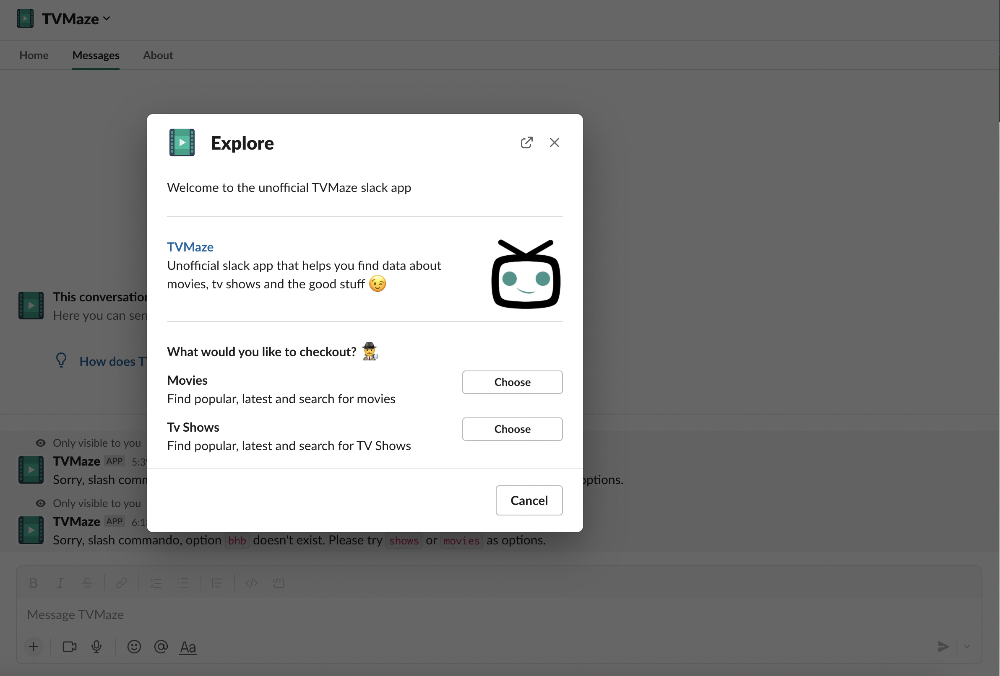
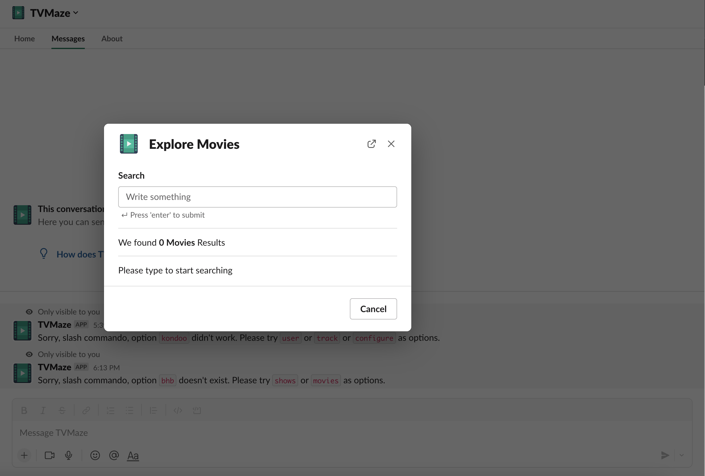
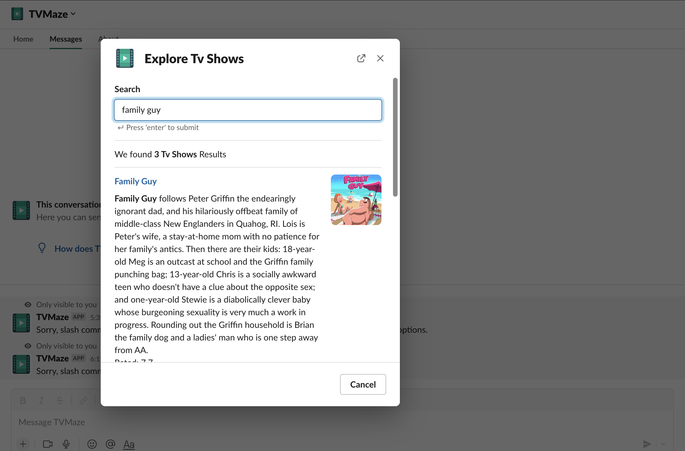

# Slack TVMaze :zap:

A slack app that integrates the TVMaze API and the OMDB API to search for both series and movies.
Done using Python in Socket Mode


## Table of contents

* [Slack TVMaze](#slack-tvmaze)
    * [Table of contents](#table-of-contents)
    * [Screenshots](#screenshots)
    * [Setting up slack app](#setting-up-slack-app)
    * [Setup](#setup)
    * [Features](#features)
    * [Status & To-Do List](#status--to-do-list)
    * [License](#license)
    * [Contact](#contact)

## Screenshots





## Setup

1. Setup environment variables
   - Create a `.env` file at the root directory and fill in the following environment variables
   ```
   SLACK_SIGNING_SECRET=""
   SLACK_BOT_TOKEN=""
   APP_TOKEN=""
    ```
2. Install dependencies - Run the following to install dependencies
    ```
    pipenv install
    ```

## Status & To-Do List
Still a work in progress ⚠️
- [ ] Document how to setup slack app
- [ ] View Movie/Tv Show details

## License

This project is licensed under the terms of the MIT license.

## Contact

Repo created by [ndungujan23](https://github.com/ndungujan23), email: ndungujan23@gmail.com